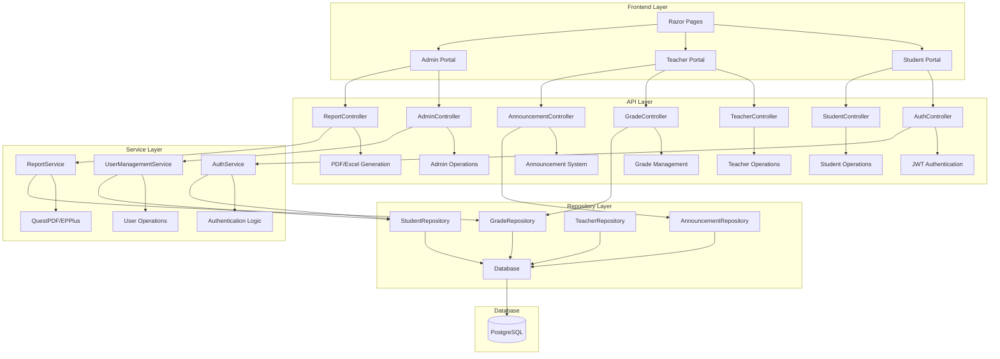
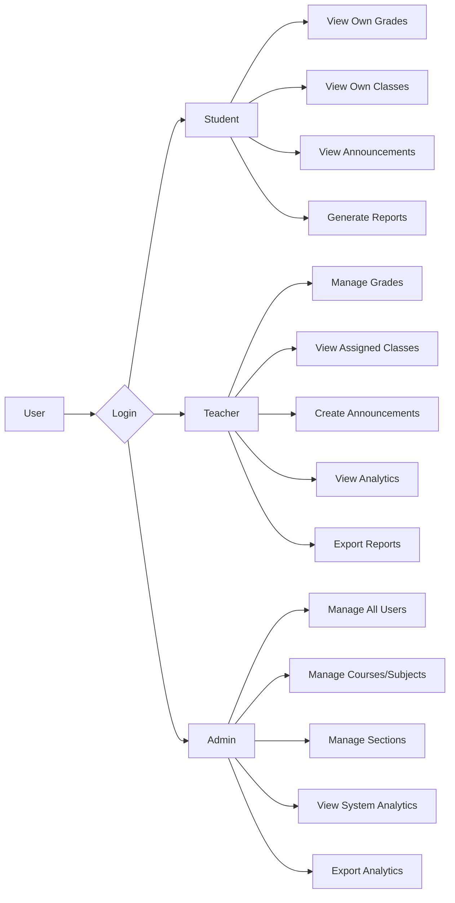
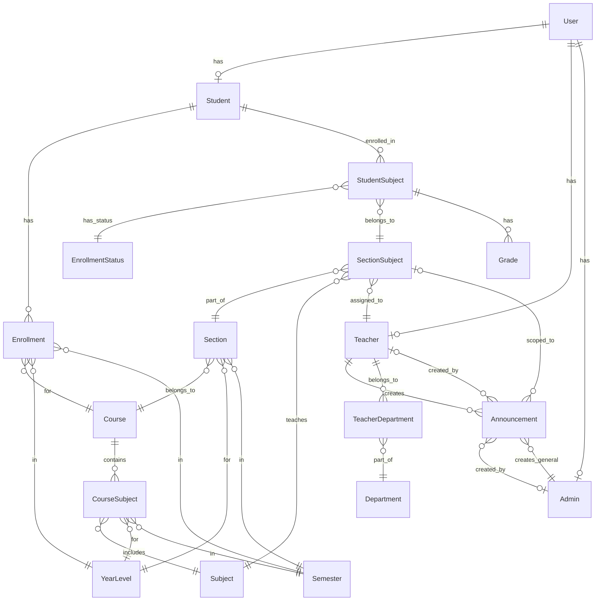
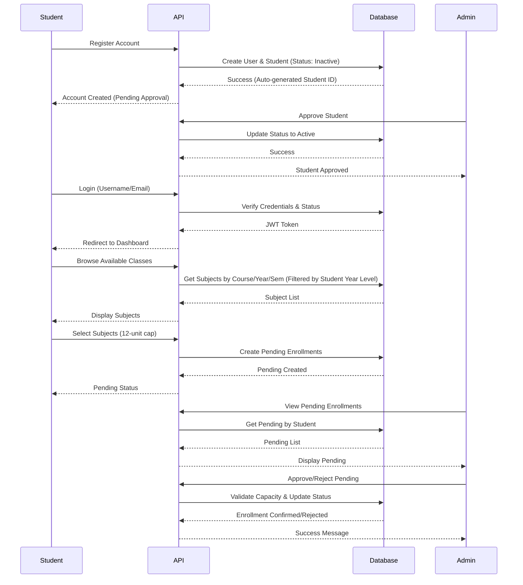
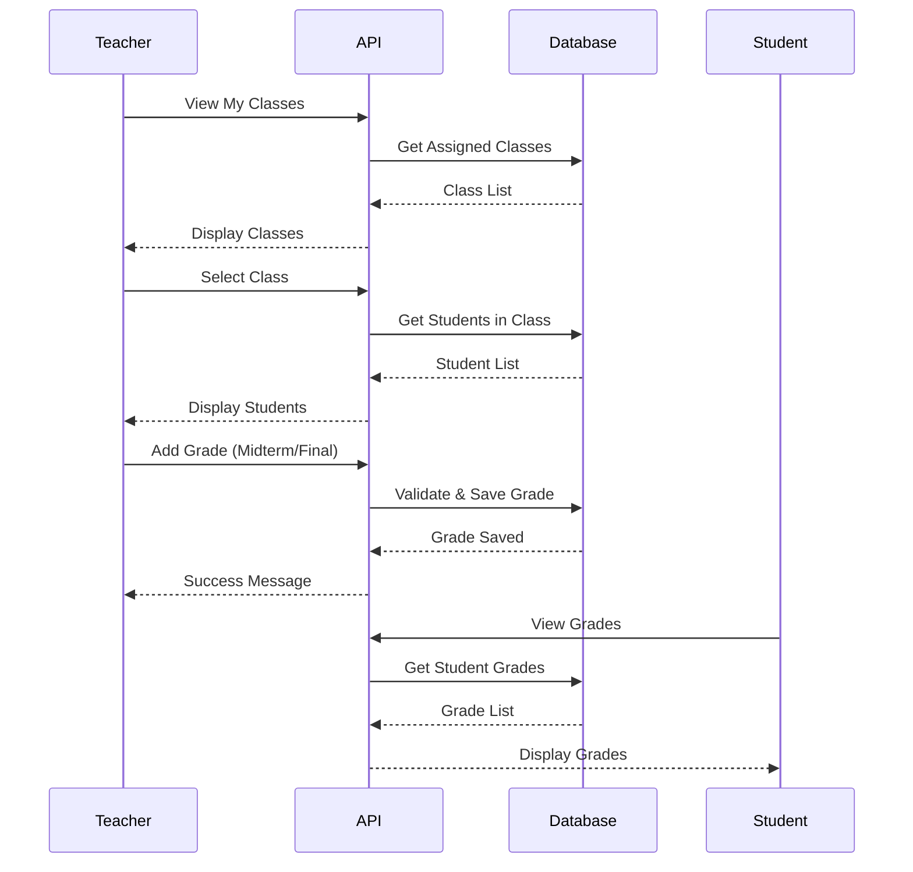
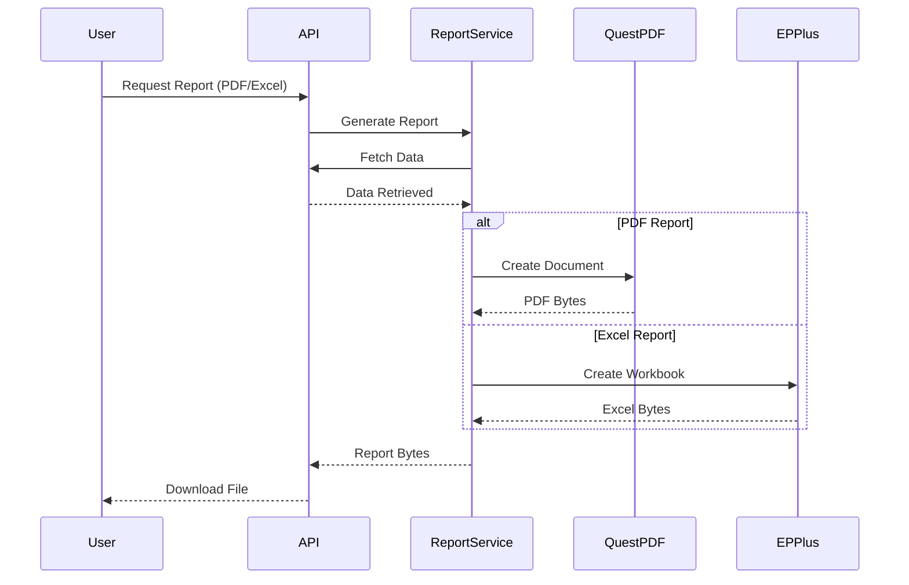

# 📚 Student Performance Tracker

A comprehensive web-based student performance tracking system built with ASP.NET Core, PostgreSQL, and modern web technologies. This system enables educational institutions to manage students, teachers, courses, grades, and generate detailed analytics reports.

## 🎯 Features

### 👨‍🎓 Student Portal
- **User Registration & Login** - Secure authentication with role-based access (login via username or email)
- **Account Status** - Pending approval status with highlighted notifications for inactive accounts
- **Dashboard** - Overview of enrolled classes, recent grades, and academic statistics
- **Enrollment System** - Comprehensive enrollment management with:
  - **Pending Enrollment Flow** - Select subjects with 12-unit cap, pending admin approval
  - **Browse Available Classes** - Filter by year level and course
  - **Browse by Section** - Semester-based section browsing with visual semester highlighting
  - **Year Level Filtering** - Automatically filtered to show only relevant sections for student's year level
  - **Entire Section Enrollment** - Option to enroll in entire sections
- **My Classes** - View all enrolled subjects with schedules, teachers, and EDP codes
- **My Grades** - Detailed grade breakdown by subject with Midterm and Final grades
- **Grade Reports** - Generate and download PDF/Excel reports of academic performance
- **Announcements** - View announcements including:
  - Class-specific announcements from teachers
  - General announcements from admins (with visual distinction)
- **Profile Management** - View and update personal information (first name, last name, phone) with real academic statistics (GPA, units, subjects)
- **Auto-Generated Student ID** - Unique student ID format: `ucmn-{YYMMDD}{studentId}`

### 👨‍🏫 Teacher Portal
- **Dashboard** - Overview of assigned classes, student statistics, and recent activity
- **My Classes** - Manage all assigned classes with student enrollment details
- **Grade Management** - Add, update, and delete student grades (Midterm and Final)
- **Class Reports** - Generate PDF/Excel reports for entire classes
- **Analytics Dashboard** - Comprehensive analytics with:
  - Grade distribution charts
  - Pass/Fail rate analysis
  - Class performance comparison
  - Student performance trends
  - Midterm vs Final grade comparison
- **Analytics Export** - Export analytics dashboard to PDF/Excel
- **Announcements** - Create and manage:
  - Class-scoped announcements for students
  - View general announcements from admins (with visual distinction)
- **Profile Management** - View and update profile with:
  - Personal information (first name, last name, phone)
  - Professional information (highest qualification, emergency contact)
  - Real-time teaching statistics (classes, students, subjects, total units)

### 👨‍💼 Admin Portal
- **Dashboard** - System-wide statistics and overview
- **Student Management** - Comprehensive student management with:
  - Create students (automatically set to "Active" status)
  - View all students with search and filter capabilities
  - Edit student details (first name, last name, email, phone, course, year level)
  - Username and Student ID are read-only (auto-generated)
  - Auto-generated Student ID format: `ucmn-{YYMMDD}{studentId}`
- **Teacher Management** - Create, view, update, and delete teacher accounts
- **User Management** - Manage all user accounts with status control
- **Course Management** - Create and manage academic courses
- **Subject Management** - Manage subjects with units and descriptions
- **Section Management** - Advanced section management with:
  - Create sections with duplicate validation
  - Search sections by name
  - Filter sections by course
  - Edit section details (name, max capacity, course, year level, semester)
- **Enrollment Management** - Comprehensive enrollment management:
  - View pending enrollments grouped by student
  - Approve or reject pending enrollments
  - Capacity validation during approval
  - Unit cap enforcement (12 units maximum)
- **General Announcements** - Create and manage system-wide announcements:
  - Visible to all students and teachers
  - Create, edit, and delete general announcements
  - Only the creating admin can edit/delete their announcements
  - Priority levels: General, Important, Urgent
- **Analytics Dashboard** - System-wide analytics with:
  - Student enrollment by course
  - Grade distribution across all courses
  - Pass/Fail rates
  - Faculty load distribution
  - Course performance overview
- **Analytics Export** - Export analytics dashboard to PDF/Excel with timestamp
- **Scrollable Sidebar** - Responsive sidebar navigation that scrolls on smaller screens

## 🏗️ System Architecture



## 🔐 User Roles & Permissions



## 📊 Database Schema



## 🔄 User Workflows

### Student Enrollment Flow



### Grade Management Flow



### Report Generation Flow



## 🛠️ Technology Stack

- **Backend Framework**: ASP.NET Core 9.0
- **Database**: PostgreSQL
- **Authentication**: JWT (JSON Web Tokens)
- **PDF Generation**: QuestPDF
- **Excel Generation**: EPPlus
- **Frontend**: Razor Pages, Bootstrap 5, Chart.js
- **API Versioning**: Asp.Versioning
- **Caching**: Redis (optional)

## 📦 Installation & Setup

### Prerequisites
- .NET 9.0 SDK
- PostgreSQL 12+
- Node.js (for frontend assets, optional)

### Database Setup

1. Create PostgreSQL database:
```sql
CREATE DATABASE student_performance_tracker;
```

2. Update connection string in `appsettings.json`:
```json
{
  "ConnectionStrings": {
    "DefaultConnection": "Host=localhost;Database=student_performance_tracker;Username=your_user;Password=your_password"
  }
}
```

3. Run migration scripts in order:
   - `Migrations/rbac-migration.sql`
   - `Migrations/departments-migration.sql`
   - `complete-enrollment-system-migration.sql`
   - `announcements_table.sql`
   - `Migrations/admin-general-announcements-migration.sql` (PostgreSQL)

### Application Setup

1. Clone the repository:
```bash
git clone <repository-url>
cd StudentPeformanceTracker
```

2. Restore dependencies:
```bash
dotnet restore
```

3. Build the project:
```bash
dotnet build
```

4. Run the application:
```bash
dotnet run
```

5. Access the application:
   - URL: `https://localhost:5001` or `http://localhost:5000`
   - Default admin credentials (if seeded): Check `Data/DbInitializer.cs`

## 🔌 API Endpoints

### Authentication
- `POST /api/v1/auth/login` - User login (supports username or email for all roles)
- `POST /api/v1/auth/register` - User registration
- `POST /api/v1/auth/register/student` - Student registration (self-registration: Inactive status, admin-created: Active status)
- `POST /api/v1/auth/refresh` - Refresh JWT token
- `POST /api/v1/auth/logout` - User logout

### Student Endpoints
- `GET /api/v1/student/profile` - Get student profile (includes CourseId)
- `PUT /api/v1/student/profile` - Update student profile (first name, last name, phone)
- `GET /api/v1/studentsubject/student/{id}/enrolled` - Get enrolled classes
- `GET /api/v1/studentsubject/student/{id}/pending` - Get pending enrollments
- `POST /api/v1/studentsubject/enroll` - Enroll via EDP code
- `POST /api/v1/studentsubject/select` - Select subjects for pending enrollment (12-unit cap)
- `DELETE /api/v1/studentsubject/{id}` - Drop class
- `DELETE /api/v1/studentsubject/pending/{id}` - Delete pending enrollment

### Teacher Endpoints
- `GET /api/v1/teacher/profile` - Get teacher profile
- `PUT /api/v1/teacher/profile` - Update teacher profile (first name, last name, phone, highest qualification, emergency contact)
- `GET /api/v1/teacher/classes` - Get assigned classes
- `GET /api/v1/sectionsubject/teacher/{id}` - Get classes by teacher ID

### Grade Management
- `GET /api/v1/grade/student/{id}` - Get student grades
- `GET /api/v1/grade/studentsubject/{id}` - Get grades for student-subject
- `POST /api/v1/grade` - Create grade (Teacher only)
- `PUT /api/v1/grade/{id}` - Update grade (Teacher only)
- `DELETE /api/v1/grade/{id}` - Delete grade (Teacher only)

### Reports
- `GET /api/v1/report/student/{id}/grades/pdf` - Student grade report (PDF)
- `GET /api/v1/report/student/{id}/grades/excel` - Student grade report (Excel)
- `GET /api/v1/report/teacher/class/{id}/pdf` - Class grade report (PDF)
- `GET /api/v1/report/teacher/class/{id}/excel` - Class grade report (Excel)
- `GET /api/v1/report/teacher/{id}/analytics/pdf` - Teacher analytics (PDF)
- `GET /api/v1/report/teacher/{id}/analytics/excel` - Teacher analytics (Excel)
- `GET /api/v1/report/admin/analytics/pdf` - Admin analytics (PDF)
- `GET /api/v1/report/admin/analytics/excel` - Admin analytics (Excel)

### Announcements
- `GET /api/v1/announcement` - Get active announcements (Student/Teacher - includes class-specific and general)
- `GET /api/v1/announcement/{id}` - Get announcement by ID (Student/Teacher/Admin)
- `POST /api/v1/announcement` - Create class announcement (Teacher only)
- `PUT /api/v1/announcement/{id}` - Update class announcement (Teacher only, own announcements)
- `DELETE /api/v1/announcement/{id}` - Delete class announcement (Teacher only, own announcements)
- `GET /api/v1/announcement/admin/general` - Get all general announcements (Admin only)
- `POST /api/v1/announcement/admin/general` - Create general announcement (Admin only)
- `PUT /api/v1/announcement/admin/general/{id}` - Update general announcement (Admin only, own announcements)
- `DELETE /api/v1/announcement/admin/general/{id}` - Delete general announcement (Admin only, own announcements)

### Admin Endpoints
- `GET /api/v1/admin/profile` - Get admin profile
- `PUT /api/v1/admin/profile` - Update admin profile
- `GET /api/v1/admin/sectionsubject/teacher/{id}` - Get classes by teacher (Admin)
- `GET /api/v1/user-management` - Get all users (Admin only)
- `POST /api/v1/teacher/admin-create` - Create teacher (Admin only)
- `DELETE /api/v1/user-management/{id}` - Delete user (Admin only)
- `GET /api/v1/student` - Get all students with pagination (Admin only)
- `GET /api/v1/student/{id}` - Get student by ID (Admin only)
- `PUT /api/v1/student/{id}` - Update student details (Admin only, username and student ID are read-only)
- `GET /api/v1/studentsubject/pending` - Get all pending enrollments grouped by student (Admin only)
- `POST /api/v1/enrollment/approve` - Approve pending enrollments (Admin only, with capacity validation)
- `POST /api/v1/enrollment/reject` - Reject pending enrollments (Admin only)
- `GET /api/v1/section` - Get all sections (Admin only)
- `POST /api/v1/section` - Create section (Admin only, with duplicate validation)
- `PUT /api/v1/section/{id}` - Update section (Admin only, with duplicate validation)

## 📈 Features Breakdown

### Analytics & Reporting

#### Admin Analytics
- **Key Metrics**: Total students, active faculty, courses offered, average performance
- **Enrollment by Course**: Top 10 courses by enrollment
- **Grade Distribution**: A-F grade ranges with counts
- **Pass/Fail Rate**: System-wide pass and fail percentages
- **Faculty Load**: Top 10 faculty by student count and classes

#### Teacher Analytics
- **Key Metrics**: Total classes, total students, average grade, pass rate
- **Grade Distribution**: Distribution across grade ranges
- **Class Performance**: Average grade per class
- **Pass/Fail Analysis**: Pass and fail rates with student counts
- **Trends**: Grade trends over time

### Announcement System
- **Class-Scoped Announcements**: Teachers post announcements to specific classes
- **General Announcements**: Admins can create system-wide announcements visible to all students and teachers
- **Role-Based Visibility**: 
  - Students see announcements from enrolled classes + general announcements
  - Teachers see announcements from their assigned classes + general announcements
  - Visual distinction between class-specific and general announcements
- **Priority Levels**: General, Important, Urgent
- **Active/Inactive**: Toggle announcement visibility
- **Ownership Control**: 
  - Teachers can only edit/delete their own class announcements
  - Admins can only edit/delete their own general announcements

### Grade Management
- **Assessment Types**: Midterm and Final Grade
- **Auto-Calculation**: Automatic percentage and remarks calculation
- **Grade Scale**: 1.0 (Excellent) to 5.0 (Failed)
- **Remarks**: Excellent, Very Good, Good, Pass, Failed
- **Validation**: Prevents duplicate grades of same type

### Enrollment Management
- **Pending Enrollment System**: Students select subjects with 12-unit cap, pending admin approval
- **Unit Cap Enforcement**: Maximum 12 units per enrollment period
- **Capacity Validation**: Automatic capacity checking during approval
- **Year Level Filtering**: Students only see sections relevant to their year level
- **Semester-Based Browsing**: Browse sections by semester with visual highlighting
- **Entire Section Enrollment**: Option to enroll in all subjects of a section
- **Status Management**: Pending → Enrolled/Rejected workflow

### User Management
- **Auto-Generated Student IDs**: Format `ucmn-{YYMMDD}{studentId}` (e.g., `ucmn-2511112001`)
- **Status Control**: 
  - Self-registered students: "Inactive" (pending approval)
  - Admin-created students: "Active" (immediate access)
- **Flexible Login**: All roles can login with username or email
- **Account Status Notifications**: Highlighted messages for pending approval accounts
- **Read-Only Fields**: Username and Student ID cannot be modified after creation

## 🔒 Security Features

- **JWT Authentication**: Secure token-based authentication
- **Role-Based Authorization**: Student, Teacher, Admin policies
- **Password Hashing**: BCrypt password hashing
- **HttpOnly Cookies**: Secure cookie storage for tokens
- **CORS Configuration**: Cross-origin resource sharing setup
- **Input Validation**: Server-side validation for all inputs
- **Account Status Verification**: Login blocked for inactive accounts with clear messaging
- **Ownership Validation**: Users can only modify their own resources (announcements, profiles)
- **Capacity Validation**: Prevents over-enrollment in sections
- **Duplicate Prevention**: Server-side validation for duplicate sections and enrollments

## 📝 License

This project is licensed under the MIT License - see the LICENSE file for details.

## 👥 Contributing

1. Fork the repository
2. Create a feature branch (`git checkout -b feature/AmazingFeature`)
3. Commit your changes (`git commit -m 'Add some AmazingFeature'`)
4. Push to the branch (`git push origin feature/AmazingFeature`)
5. Open a Pull Request

## 📞 Support

For support, email support@example.com or create an issue in the repository.

---

**Built with ❤️ using ASP.NET Core**
